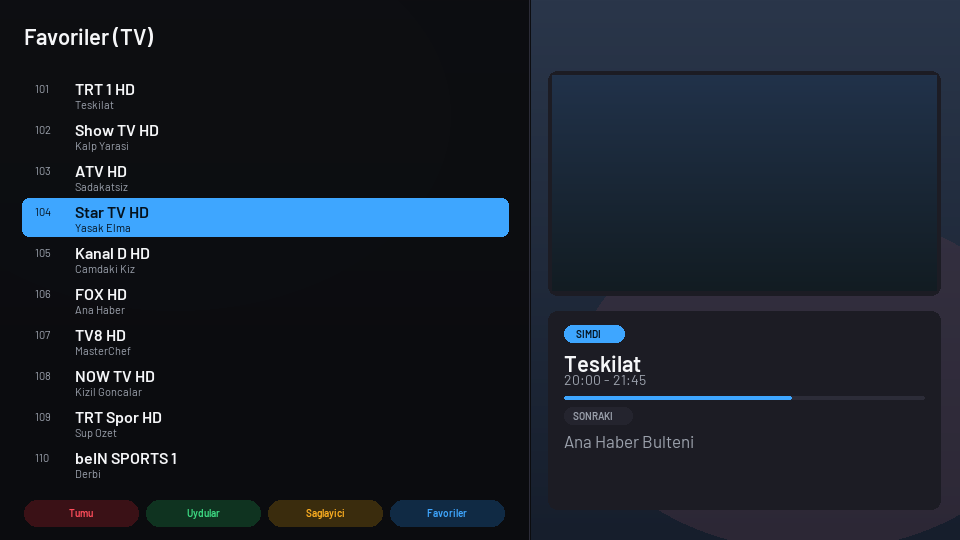
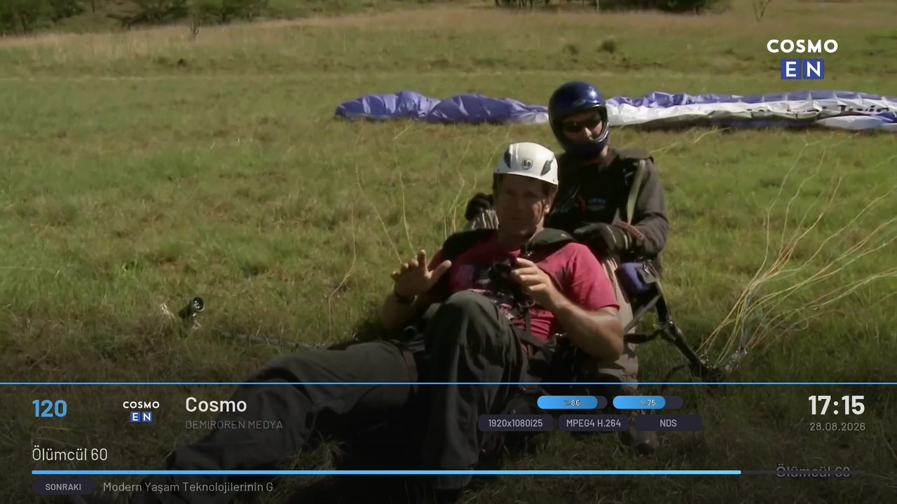
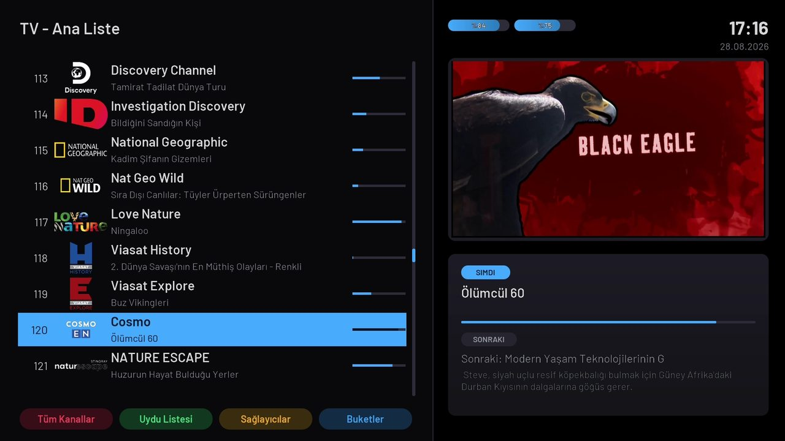
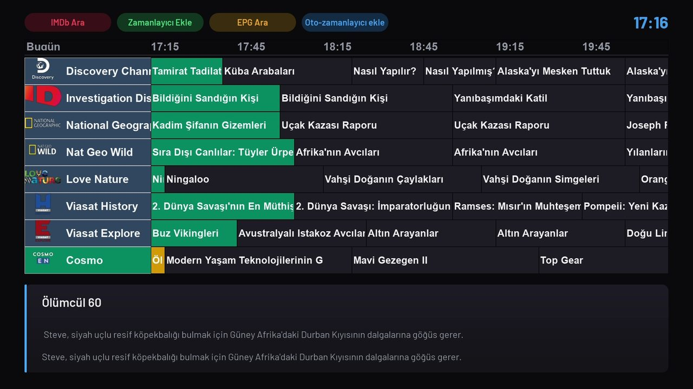
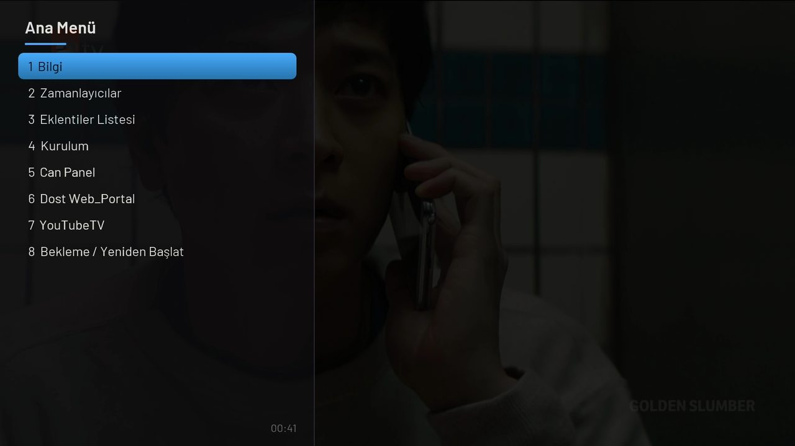
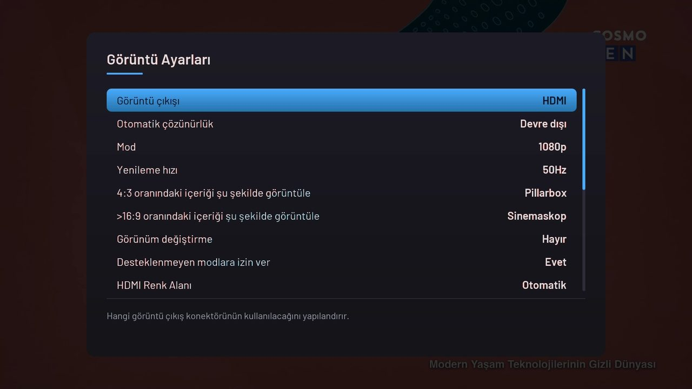
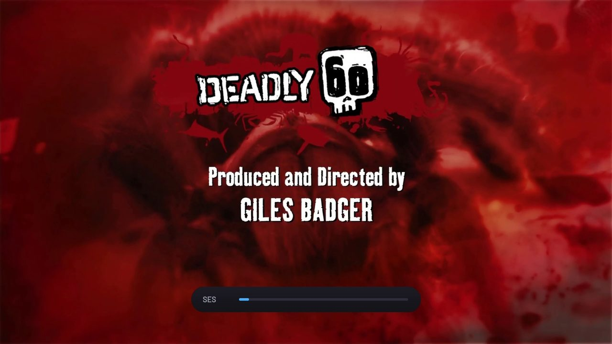

# TiviATV FHD

TiviMate düzeninde, 1920×1080 openATV / enigma2 skini.
Yuvarlak köşeler, gradientler, ilerleme çubukları ve seçim vurgusu — hepsi
enigma2'nin kendi çizim motoruyla, **tek bir PNG kullanılmadan**.



## Gereksinim

openATV **7.3+**. `cornerRadius`, gradient ve `itemCornerRadiusSelected`
enigma2 motoruna 7.3 ile girdi; 7.2 ve altındaki dallarda bu tanımlar yok,
köşeler kare çıkar.

## Kurulum

Klasörü olduğu gibi kutuya kopyala:

```
/usr/share/enigma2/TiviAtv-FHD/
```

InfoBar'daki sinyal / akış hızı göstergesi bir converter kullanır, o da
enigma2'nin converter dizinine gider:

```
TiviAtv-FHD/converter/TiviAtvSignal.py  →  /usr/lib/enigma2/python/Components/Converter/
```

Kopyalanmazsa skin yine açılır, yalnız o alan boş kalır.

Sonra: **Menü → Ayarlar → Sistem → Kullanıcı arayüzü → Skin seçimi**

TiviMate görünümü için kanal listesini iki satırlı moda al —
**Menü → Ayarlar → Kanal seçimi**:

- "İki satırlı servis listesi" = **Evet**
- "Sayfa başına öğe" = **10**

> Kanal listesi satır yüksekliği skinden gelmez. enigma2 bunu
> `liste yüksekliği ÷ sayfa başına öğe` olarak hesaplar
> (`ServiceList.setItemsPerPage`), yani `serviceItemHeight` bu hesabın altında
> kalır. Satırlar sık ya da seyrek görünüyorsa o ayarı değiştir.

## Ekranlar

Hepsi bir Octagon SX88V2 4K üzerinde, openATV 8.0'da çekildi.

### InfoBar

Saydam alt bant, kanal logosu, çift satır program bilgisi. Sağ üstte uydu
kanalında SNR/AGC yüzdeleri, IPTV'de akış hızı — ikisi de aynı alanı paylaşır,
hangi kaynak aktifse o görünür.



### Kanal listesi

İki satırlı servis listesi, picon, ilerleme çubuğu; sağda canlı önizleme ve
şimdi/sonraki kartı.



### Program rehberi



### Menü

Tam boy sol panel, 14 satır kapasite.



### Ayarlar



### Ses



## Tanımlı ekranlar

`InfoBar` · `SecondInfoBar` · `ChannelSelection` · `SimpleChannelSelection` ·
`ChannelSelectionRadio` · `EPGSelection` · `GraphicalEPG` · `GraphicalEPGPIG` ·
`EPGSelectionMulti` · `GraphMultiEPG` · `GraphMultiEPGList` · `EventView` ·
`Menu` · `Setup` · `MessageBox` · `ChoiceBox` · `Volume` ·
`Mute` · `NumberZap` · `AudioSelection` · `SkinSelection` · `PluginBrowser` ·
`PackageAction` · `SimpleSummary`

Ayrıca enigma2'nin standart renk adları (`window-bg`, `window-fg`, `key_red`,
`grey` …) skin paletine eşlendi. Bunlar tanımsızken, skinde karşılığı olmayan
her ekran — üçüncü taraf eklentiler dahil — `parseColor` hatasına düşüp
okunaksız kalıyordu.

> EPG ekranlarının adı openATV 8 ile değişti: `GraphMultiEPG` yerine
> `GraphicalEPG` / `GraphicalEPGPIG` / `EPGSelectionMulti` aranıyor. Eski adlar
> 7.3–7.5 dalları için duruyor.

Burada tanımlı olmayan ekranlar openATV'nin kendi `skin_default.xml`'inden gelir,
yani hiçbir ekran boş kalmaz.

## Özelleştirme

### Renkler

Tek yerden değişir — `TiviAtv-FHD/skin.xml` başındaki `<colors>` bloğu.

> **Alfa terstir.** Format `#AARRGGBB` ama `AA` = *şeffaflık*:
> `00` tamamen opak, `FF` tamamen görünmez. CSS'ten alışkın olanın en sık
> düştüğü tuzak.

Gradient, `<colors>` bloğunda **tanımlanamaz** — `parseColor` orada yalnız
`#aarrggbb` kabul eder, virgüllü değer sessizce beyaza düşer. Gradient doğrudan
elemanın attribute'una yazılır; `backgroundColor` / `foregroundColor` değerinde
virgül görürse `parseGradient`'e gider:

```xml
<eLabel backgroundColor="#001c1c24,#00141419,vertical" />
```

Sözdizimi: `başlangıç[,orta],bitiş,vertical|horizontal[,alphaBlend]`

### Yuvarlak köşeler

```xml
cornerRadius="24"                   <!-- dört köşe -->
cornerRadius="3;left"               <!-- sadece sol -->
cornerRadius="30;topLeft,topRight"  <!-- seçili köşeler -->
```

Geçerli köşe adları: `topLeft` `topRight` `top` `bottomLeft` `bottomRight`
`bottom` `left` `right`

### Font

Dört `.ttf` dosyasını değiştir, `<fonts>` bloğundaki adları güncelle.
Font adları (`TM` / `TMM` / `TMB` / `TMX`) aynı kalırsa başka hiçbir şey değişmez.

## Araçlar

Depo kökünden çalıştırılır, hiçbirinde sabit yol yok.

| Betik | Ne yapar |
|---|---|
| `tools/lint_skin.py` | Skini openATV'nin **gerçek** attribute listesine karşı denetler — `skin.py` ve `ServiceList.py`'yi upstream'den indirip parse eder. Tanımsız renk/font, ekran dışına taşan eleman, bilinmeyen attribute yakalar. |
| `tools/render_preview.py` | `preview.html`'i üretir — ekranları skin.xml'in gerçek koordinat, renk ve yarıçaplarından tarayıcıda çizer. |
| `tools/make_thumb.py` | Skin seçicideki `prev.png`'yi üretir. |
| `tools/make_designer_copy.py` | OpenSkin Designer uyumlu kopya üretir (aşağıya bak). |

Gereksinim: Python 3.9+ ve `Pillow` (yalnız `make_thumb.py` için).

```bash
pip install pillow
```

## OpenSkin Designer notları

[OpenSkin Designer](https://github.com/iMaxxx/OpenSkin-Designer) 2014'ten ve
skini olduğu gibi açamaz. `tools/make_designer_copy.py` uyumlu bir kopya üretir:

| Sorun | Neden | Kopyada |
|---|---|---|
| `<alias>` | `cDataBase.initFonts` `<fonts>` altındaki **her** çocuk düğümden `filename` okuyor, düğüm adı filtresi yok → `NullReferenceException` | kaldırılır |
| Blok içi XML yorumları | Yorum düğümünde hiç attribute yok, aynı çökme | kaldırılır |
| Gradient renk değerleri | `#a,#b,vertical` renk olarak ayrıştırılamaz | iki durağın ortalaması alınır |
| `<windowstyle>` içindeki `listbox`/`label`/`configList`/`scrolllabel` | Çalışan örnek skinlerde yok, `name` attribute'u yok | kaldırılır |

`cornerRadius` string'i programın binary'sinde hiç geçmiyor — skin tasarımcıda
**her zaman kare köşeli** görünür. Yuvarlaklık yalnız kutuda, enigma2 çizerken
ortaya çıkar.

```bash
python tools/make_designer_copy.py
```

## Lisans

Skin dosyaları MIT ile — bkz. [LICENSE](LICENSE).
Barlow fontu SIL Open Font License 1.1 altındadır, ayrıntılar `OFL-Barlow.txt`.
Kanal logoları (picon) skine dahil değildir; ayrı paket olarak
`/usr/share/enigma2/picon/` altına kurulur.

---

## In English

A TiviMate-style 1080p skin for openATV / enigma2. Rounded corners, gradients,
progress bars and selection highlights are drawn by the enigma2 engine itself —
**no PNG assets at all**.

Needs openATV **7.3+** — that is when `cornerRadius`, gradients and
`itemCornerRadiusSelected` landed in the engine.

Copy the folder to `/usr/share/enigma2/`, pick it under
**Menu → Setup → System → User interface → Skin**, and enable the two-line
service list for the TiviMate layout.

The `tools/` scripts regenerate the preview and the thumbnail from `skin.xml`.
